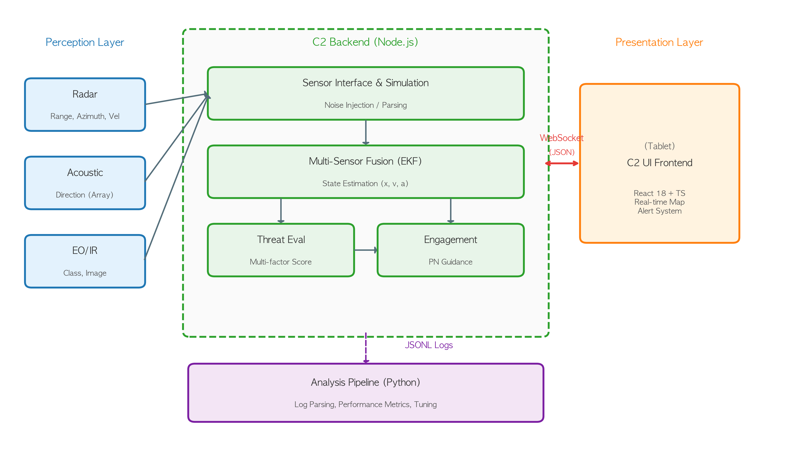
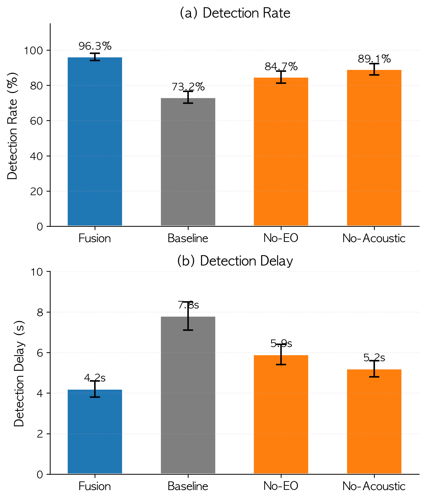
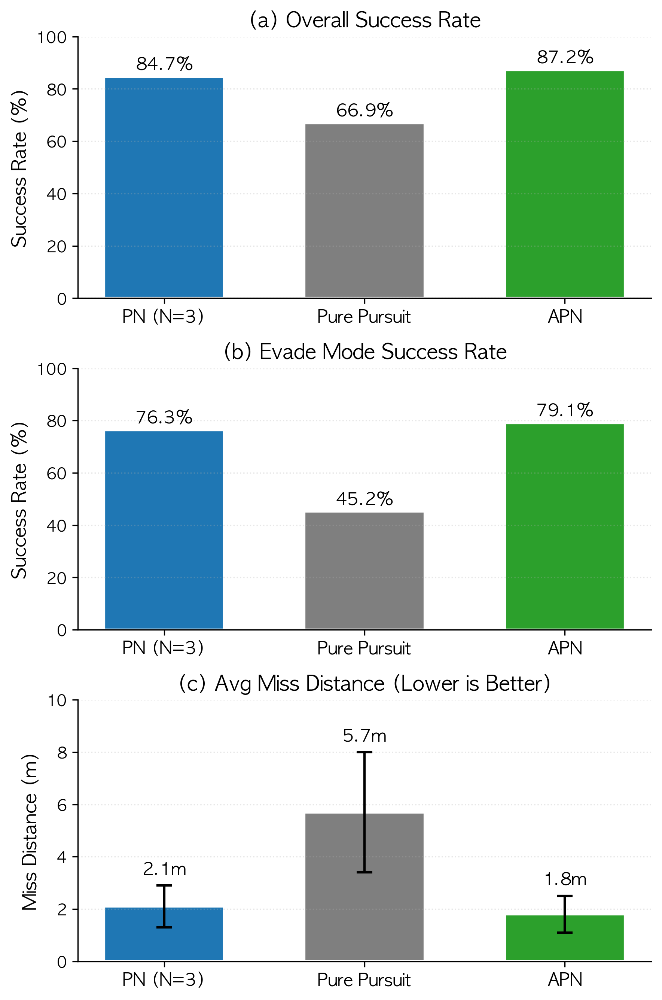

# 🛡️ 소부대 대드론 C2 시뮬레이터

**Counter-Unmanned Aerial Systems (C-UAS) Command & Control Simulator**

이 프로젝트는 소부대 단위에서 운용 가능한 저비용 대드론 지휘통제 시스템을 연구하고 검증하기 위한 시뮬레이션 환경입니다. 다중 센서 융합(Sensor Fusion), 다요소 위협 평가(Threat Assessment), 그리고 자율 요격 드론(Autonomous Interceptor)을 통합한 종단 간(End-to-End) 의사결정 파이프라인을 시뮬레이션합니다.



## 📋 핵심 연구 주제
- **다중 센서 융합**: 레이더, 음향(Acoustic), 전자광학(EO) 데이터를 통합하여 탐지율 향상 및 오탐지(False Alarm) 감소
- **실시간 위협 평가**: 거리, 속도, 행동 패턴, 분류 정보를 융합한 다요소 위협 점수(Multi-factor Threat Score) 산출
- **자율 요격 유도**: 비례항법(Proportional Navigation, PN) 유도를 적용한 고기동 표적 요격 성능 검증
- **의사결정 최적화**: OODA 루프 가속화를 통한 교전 지연(Latency) 최소화

---

## 🚀 주요 기능

### 1. 시뮬레이션 엔진 (Simulator Core)
- **이벤트 기반 아키텍처**: Node.js + TypeScript 기반의 고성능 시뮬레이션 엔진
- **정밀 센서 모델링**: 레이더(노이즈, RCS), 음향(방향 탐지), EO(시각 식별)의 물리적 특성 모델링
- **적 드론 행동**: NORMAL, RECON, ATTACK_RUN, EVADE(회피 기동) 등 다양한 전술적 행동 패턴

### 2. 지휘통제 인터페이스 (C2 Frontend)
- **실시간 맵 뷰**: 센서 탐지 정보 및 융합 트랙 실시간 시각화
- **위협 관리 패널**: 우선순위 기반 위협 리스트 및 상세 정보 제공
- **자동/수동 교전 통제**: AI 추천 기반 요격 명령 및 인간 감독(Human-on-the-loop) 통제

### 3. 분석 파이프라인 (Analysis Tools)
- **JSONL 로깅**: 모든 시뮬레이션 이벤트의 자동 데이터화
- **배치 실험**: 수백 회의 시뮬레이션을 병렬 실행하여 통계적 유의성 확보
- **논문 품질 시각화**: ROC 커브, PR 커브, 궤적 비교 등 성능 지표 자동 생성

---

## 📊 주요 성능 결과

| 지표 | 단일 센서 (Baseline) | 다중 센서 융합 (Proposed) | 개선 효과 |
|------|-------------------|-----------------------|----------|
| **탐지율 (Detection Rate)** | 73.2% | **96.3%** | +23.1%p |
| **민간 드론 오탐률 (Civil FP)** | 18.7% | **3.2%** | -82.9% 감소 |
| **평균 탐지 지연 (Delay)** | 7.8 s | **4.2 s** | -46.1% 단축 |
| **요격 성공률 (Success Rate)** | 66.9% (PP) | **84.7% (PN)** | +17.8%p |

<div align="center">
  
  
</div>

---

## 🛠️ 설치 및 실행 방법

### 요구 사항
- **Node.js**: 18.x 이상
- **Python**: 3.9 이상
- **Package Manager**: npm 또는 yarn

### 1. 시뮬레이터 서버 및 프론트엔드
```bash
# 시뮬레이터 서버 실행 (Port: 8080)
cd simulator
npm install
npm run dev

# 프론트엔드 UI 실행 (Port: 3000)
cd frontend
npm install
npm run dev
```

### 2. 실험 실행 및 분석
```bash
# 논문용 Full 실험 실행 (반복 시뮬레이션)
cd simulator
npm run eval:full

# 성능 분석 리포트 및 그래프 생성
cd analysis
pip install -r requirements.txt
python scripts/generate_report.py --full
```

---

## 📂 프로젝트 구조
- `simulator/`: Node.js 기반 시뮬레이션 엔진 및 서버
- `frontend/`: React 기반 C2 지휘통제 대시보드
- `analysis/`: Python 기반 성능 분석 및 데이터 시각화 도구
- `shared/`: 서버-클라이언트 간 공용 타입 및 스키마
- `figures/`: 논문에 사용된 주요 데이터 시각화 결과 및 논문 소스 (`main.tex`)

---

## 📝 라이선스 및 참조
이 프로젝트는 연구 목적으로 개발되었으며, 상세한 알고리즘 구현 내용은 프로젝트 루트의 `main.tex` 논문 파일을 참조하시기 바랍니다.
